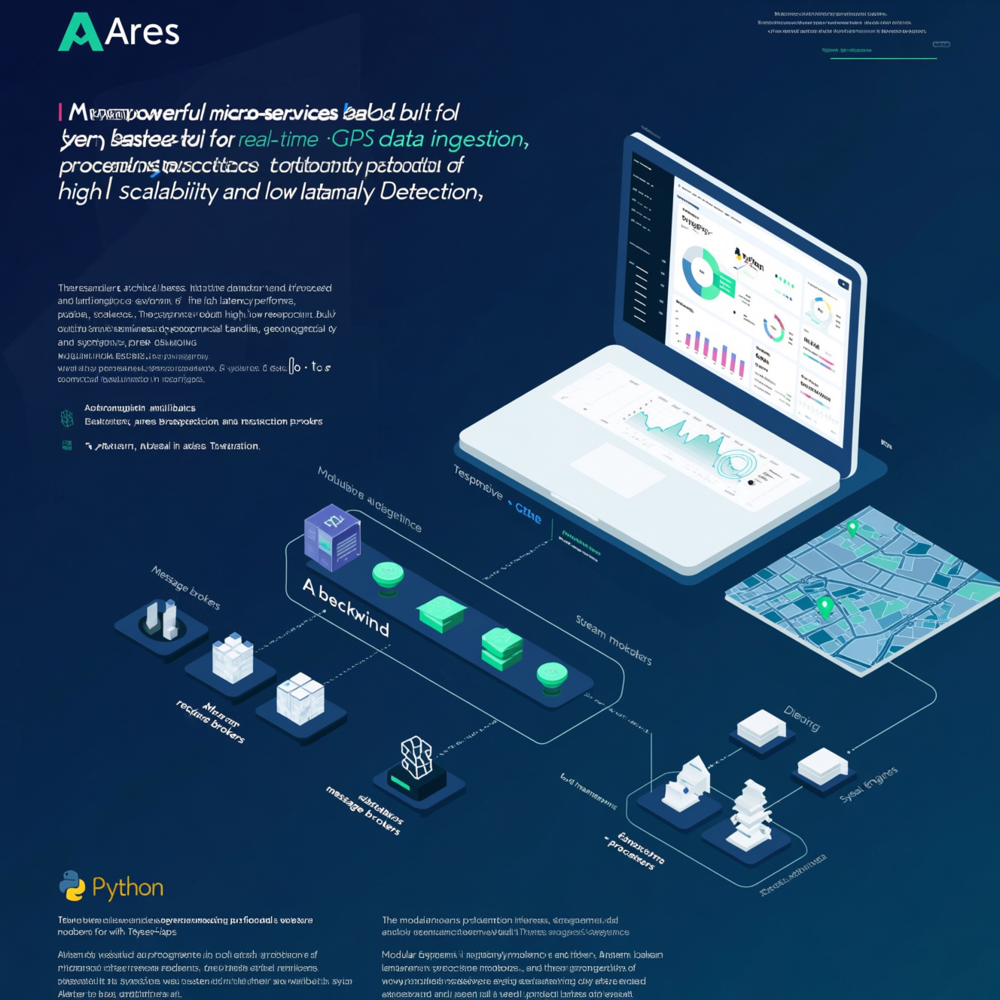

# Ares - Real-time Anomaly Detection System

[](LICENSE)
[](https://github.com/ProCodeZero/Ares/stargazers)
[](https://hub.docker.com/r/procodezero/ares)
[](https://github.com/ProCodeZero/Ares/actions)

<p align="center">
  
</p>

Ares is a robust, microservices-based system designed for real-time GPS data ingestion, analysis, and anomaly detection. It features a modern TypeScript frontend for visualization and a Python-based backend for data processing.

## Table of Contents

- [System Overview](#system-overview)
- [Architecture](#architecture)
- [Prerequisites](#prerequisites)
- [Project Structure](#project-structure)
- [Quick Start](#quick-start)
- [Services and Ports](#services-and-ports)
- [Monitoring and Metrics](#monitoring-and-metrics)
- [Use Cases](#use-cases)
- [Development](#development)
- [API Documentation](#api-documentation)
- [Troubleshooting](#troubleshooting)
- [Contributing](#contributing)
- [License](#license)

## System Overview

The system consists of several microservices:

- **Data Ingestion Service**: Handles real-time GPS data ingestion using Kafka
- **Analysis Service**: Processes data and detects anomalies
- **Frontend**: Provides a web interface for visualization and monitoring
- **Monitoring Stack**: Complete observability with Prometheus and Grafana

## Architecture

The system uses:

- Apache Kafka for real-time data streaming
- PostgreSQL for data storage
- React + TypeScript for the frontend
- Python for backend services
- Prometheus & Grafana for monitoring
- Docker and Docker Compose for containerization

## Prerequisites

- Docker and Docker Compose

## Project Structure

```
├── backend/
│   ├── analysis/          # Anomaly detection service
│   └── data-ingestion/    # Kafka consumer service
├── frontend/              # React + TypeScript web interface
├── arch/                  # Architecture diagrams
├── compose.yml           # Docker Compose configuration
└── prometheus.yml        # Prometheus configuration
```

## Quick Start

1. Clone the repository:

   ```bash
   git clone https://github.com/ProCodeZero/Ares.git
   cd Ares
   ```

2. Start the services:

   ```bash
   docker compose up -d
   ```

3. Access the services:
   - Frontend: http://localhost:80
   - Grafana: http://localhost:3000 (default credentials: admin/root)
   - Prometheus: http://localhost:9090

## Services and Ports

- Frontend: 80
- Data Ingestion Service: 8001
- Analysis Service: 8002
- Kafka: 9092
- PostgreSQL: 5432
- Prometheus: 9090
- Grafana: 3000
- Node Exporter: 9100
- Kafka Exporter: 9308
- Postgres Exporter: 9187

## Monitoring and Metrics

The system includes comprehensive monitoring with:

- Prometheus for metrics collection
- Grafana for visualization
- Custom exporters for:
  - Node metrics
  - Kafka metrics
  - PostgreSQL metrics
  - Application-specific metrics

## Use Cases

Ares can be used for:

1. Real-time GPS tracking
2. Anomaly detection in movement patterns
3. Fleet management
4. Security monitoring
5. Performance analysis

## Development

To modify or extend the system:

1. Backend Services (Python):

   - Located in `backend/` directory
   - Each service has its own `requirements.txt`
   - Use Python 3.x

2. Frontend (TypeScript):
   - Located in `frontend/` directory
   - Built with Vite + React
   - Uses TypeScript for type safety

## API Documentation

### Data Ingestion Service (Port 8001)

#### Endpoints

- `POST /api/v1/gps-data`
  - Submit GPS data for processing
  - Request body: `{ latitude: number, longitude: number, timestamp: string, deviceId: string }`

#### WebSocket

- `ws://localhost:8001/ws`
  - Real-time GPS data stream
  - Message format: `{ type: "gps_data", payload: { latitude, longitude, timestamp, deviceId } }`

### Analysis Service (Port 8002)

#### Endpoints

- `GET /api/v1/anomalies`
  - Retrieve detected anomalies
  - Query parameters: `startTime`, `endTime`, `deviceId`
- `GET /api/v1/statistics`
  - Get analysis statistics
  - Query parameters: `timeframe`

## Troubleshooting

### Common Issues

1. **Services won't start**

   ```bash
   # Check service logs
   docker compose logs [service_name]

   # Verify all required ports are available
   netstat -an | findstr "80 8001 8002 9092 5432"
   ```

2. **Kafka Connection Issues**

   - Ensure Zookeeper is running first
   - Check Kafka broker logs
   - Verify network connectivity between services

3. **Database Connection**

   - Confirm PostgreSQL is running
   - Check database credentials
   - Verify database migrations

4. **Frontend Loading Issues**
   - Clear browser cache
   - Check browser console for errors
   - Verify API endpoints are accessible

### Getting Help

- Create an issue in the GitHub repository
- Check existing issues for similar problems
- Join our [Discord community](https://discord.gg/ares) for real-time help

## Contributing

We love your input! We want to make contributing to Ares as easy and transparent as possible, whether it's:

- Reporting a bug
- Discussing the current state of the code
- Submitting a fix
- Proposing new features
- Becoming a maintainer

### Development Process

1. Fork the repo
2. Create your feature branch (`git checkout -b feature/amazing-feature`)
3. Commit your changes (`git commit -m 'Add some amazing feature'`)
4. Push to the branch (`git push origin feature/amazing-feature`)
5. Open a Pull Request

### Code Style

- Python: Follow PEP 8
- TypeScript: Use Prettier and ESLint configurations provided
- Write meaningful commit messages
- Add tests for new features

### Running Tests

```bash
# Backend tests
cd backend/analysis
python -m pytest

cd backend/data-ingestion
python -m pytest

# Frontend tests
cd frontend
npm test
```

## License

This project is licensed under the MIT License - see the [LICENSE](LICENSE) file for details.
